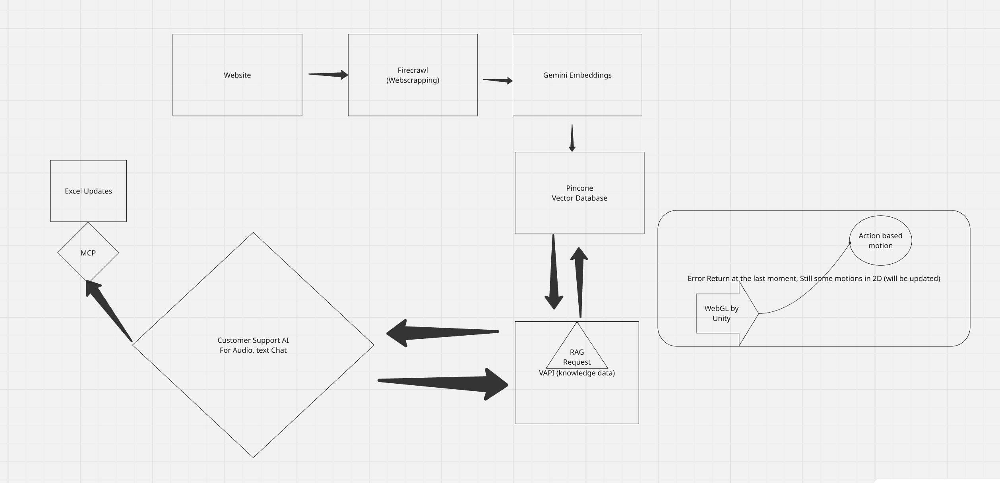

# AVEN AI Agent Web App

A sophisticated web application featuring voice and text chatbot integration with Vapi for a HELOC company offering credit cards. Built with Next.js, React, and modern UI components.


# Workflow



## Features

- **Modern UI Design**: Inspired by Wellfound.com with glass-morphism effects
- **AI Voice & Text Chat**: Integrated with Vapi for real-time voice responses
- **3D Agent Animation**: Unity WebGL integration for live agent visualization
- **Responsive Design**: Mobile-first approach with beautiful animations
- **Audio Controls**: Enable/disable audio features
- **Real-time Chat**: iPhone-style chatbox with simultaneous speech and text

## Tech Stack

- **Frontend**: Next.js 14, React 18, TypeScript
- **Styling**: Tailwind CSS with custom glass effects
- **Animations**: Framer Motion
- **Voice Integration**: Vapi AI, Web Speech API
- **3D Graphics**: Unity WebGL (placeholder ready)
- **Icons**: Lucide React

## Getting Started

### Prerequisites

- Node.js 18+ 
- npm or yarn
- Vapi API key (for voice integration)

### Installation

1. Clone the repository:
```bash
git clone <repository-url>
cd heloc-ai-agent
```

2. Install dependencies:
```bash
npm install
```

3. Set up environment variables:
```bash
cp .env.example .env.local
```

Add your Vapi API key to `.env.local`:
```
NEXT_PUBLIC_VAPI_API_KEY=your_vapi_api_key_here
```

4. Run the development server:
```bash
npm run dev
```

5. Open [http://localhost:3000](http://localhost:3000) in your browser.

## Project Structure

```
├── app/
│   ├── globals.css          # Global styles and Tailwind
│   ├── layout.tsx           # Root layout
│   └── page.tsx             # Main page
├── components/
│   ├── Header.tsx           # Navigation header
│   ├── HeroSection.tsx      # Landing hero section
│   ├── FeaturesSection.tsx  # Features showcase
│   ├── AIAgent.tsx          # Main AI agent component
│   ├── VapiIntegration.tsx  # Vapi voice integration
│   └── UnityAgent.tsx       # 3D agent visualization
├── public/                  # Static assets
└── README.md
```

## Key Components

### AIAgent
The main component that handles:
- Floating AVEN AI button (center bottom)
- Glass-like dashboard popup
- Chat interface with voice/text support
- Audio enable/disable controls

### VapiIntegration
Handles voice integration:
- Real-time speech recognition
- Voice synthesis
- Vapi API communication
- Fallback to Web Speech API

### UnityAgent
3D agent visualization:
- Animated avatar states (idle, listening, thinking)
- Visual feedback for voice interactions
- Unity WebGL integration ready

## Customization

### Vapi Configuration
Update the Vapi configuration in `components/VapiIntegration.tsx`:

```typescript
const vapi = new Vapi({
  apiKey: 'your-api-key',
  assistant: {
    model: {
      provider: 'openai',
      model: 'gpt-4',
      messages: [
        {
          role: 'system',
          content: 'Your custom system prompt for HELOC assistance'
        }
      ]
    },
    voice: {
      provider: 'elevenlabs',
      voiceId: 'your-voice-id'
    }
  }
})
```

### Unity Integration
To integrate your Unity WebGL build:

1. Build your Unity project for WebGL
2. Place the build files in `public/unity/`
3. Update `components/UnityAgent.tsx` to load the Unity build

### Styling
Customize the glass effects and colors in:
- `tailwind.config.js` - Theme configuration
- `app/globals.css` - Custom CSS classes

## Deployment

### Build for Production
```bash
npm run build
npm start
```

### Deploy to Vercel
```bash
npm i -g vercel
vercel
```

## Environment Variables

```bash
NEXT_PUBLIC_VAPI_API_KEY=your_vapi_api_key
NEXT_PUBLIC_UNITY_BUILD_URL=path_to_unity_build
```

## Features Roadmap

- [ ] Complete Vapi integration with API key
- [ ] Unity WebGL agent integration
- [ ] Advanced voice commands
- [ ] Chat history persistence
- [ ] User authentication
- [ ] HELOC calculator integration
- [ ] Application form integration

## Contributing

1. Fork the repository
2. Create a feature branch
3. Commit your changes
4. Push to the branch
5. Create a Pull Request

## License

MIT License - see LICENSE file for details.

## Support

For support and questions, contact the development team or create an issue in the repository.
